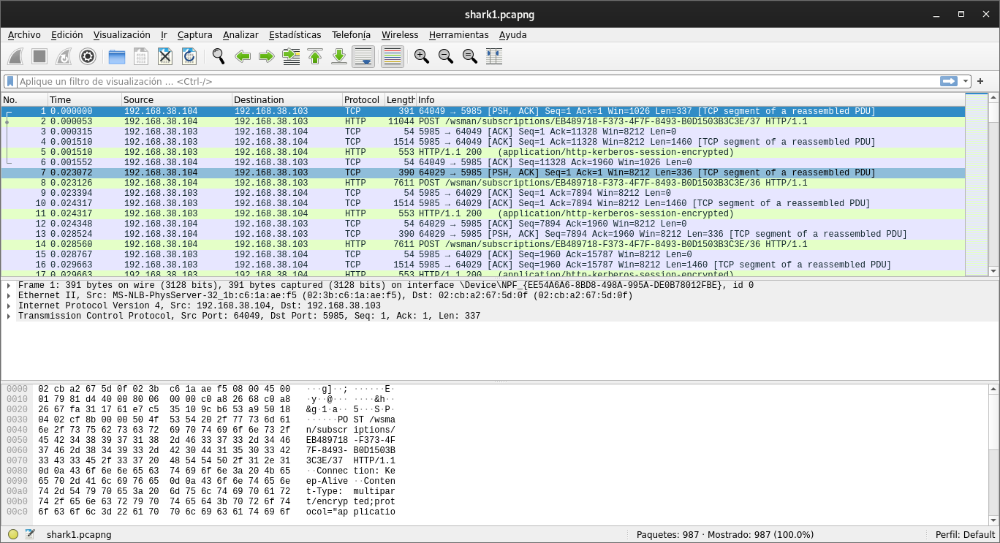
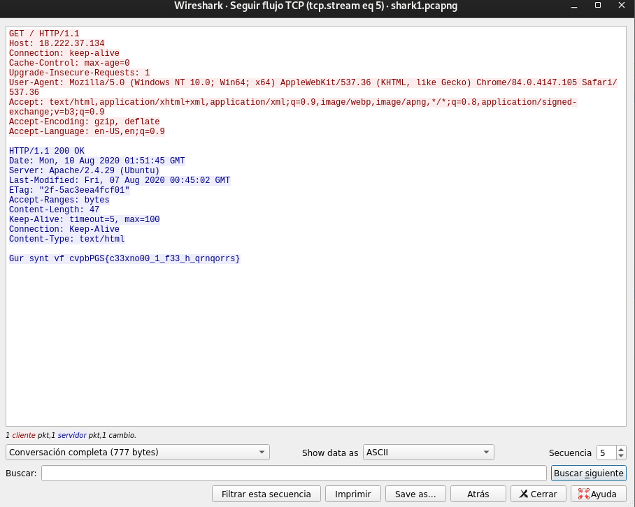

# Wireshark doo dooo do doo...

## Objetivo

Can you find the flag? [shark1.pcapng](https://mercury.picoctf.net/static/81c7862241faf4a48bd64a858392c92b/shark1.pcapng).

## Solución

Descargamos el archico con el link adjunto

```bash
hone@unidad03:~/WiresharkDOO$ file shark1.pcapng 
shark1.pcapng: pcapng capture file - version 1.0
```

Es una captura de paquetes, entonces se abre con wire Shark



Al seguir el flujo de paquetes TCP, y posicionarse en el numero 5 se muestra...



donde la ultima linea muestra *cvpbPGS{c33xno00_1_f33_h_qrnqorrs}*, utilizando CyberChef y rotandolo 13 veces, muestra la llave.

Bandera: *picoCTF{p33kab00_1_s33_u_deadbeef}*

## Referencias

[CyberChef](https://gchq.github.io/CyberChef/)
