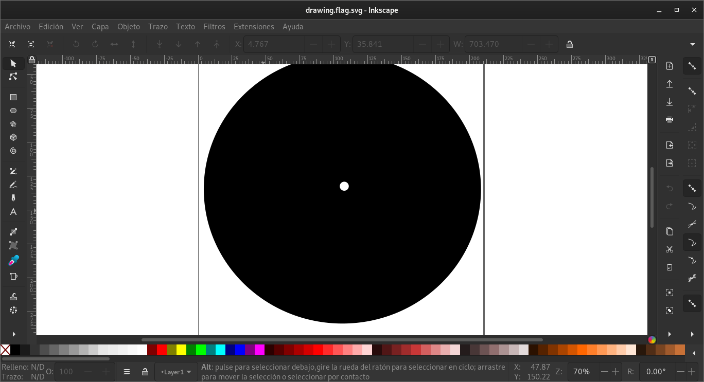
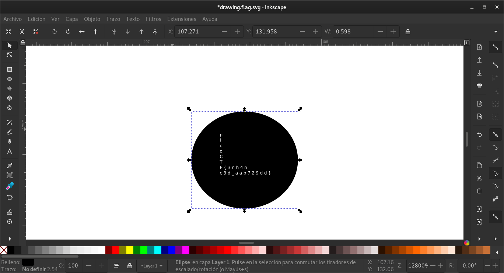

# Enhance!

## Objetivo

Download this image file and find the flag.
- [Download image file](https://artifacts.picoctf.net/c/100/drawing.flag.svg)

## Solución

Se descarga el archivo.

```bash
hone@unidad03:~/Enhance$ file drawing.flag.svg 
drawing.flag.svg: SVG Scalable Vector Graphics image
```

Nos damos cuenta que es un archivo .svg, algo asi como una imager creada con vectores, asi que se abre con una herrramienta llamada *inkscape*.



Haciendo zoom en el centro de la imagen se pueder observar un circulo mas pequeño, donde esta la bandera.



Bandera: *picoCTF{3nh4nc3d_aab729dd}*

## Referencias
