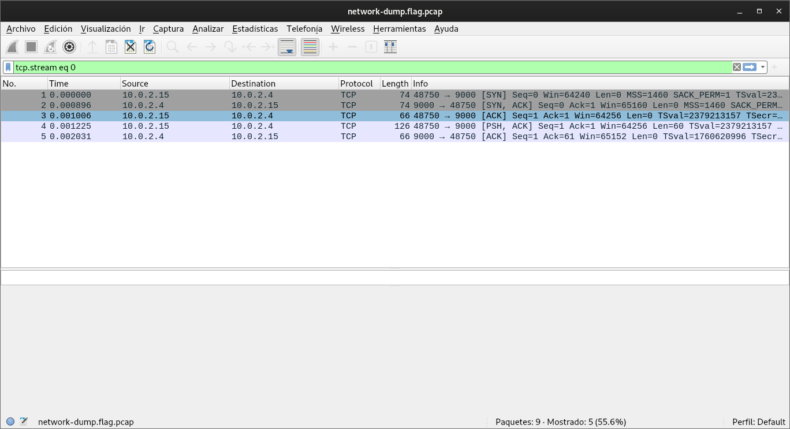
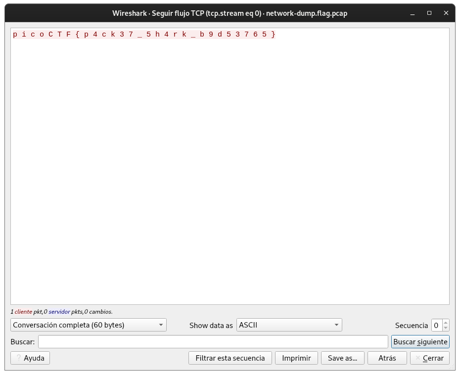

# Packets Primer

## Objetivo

Download the packet capture file and use packet analysis software to find the flag.
- [Download packet capture](https://artifacts.picoctf.net/c/195/network-dump.flag.pcap)

## Solución

Al seguir la trama de paquetes en la primera secuencia se puede observar la bandera

Bandera: *picoCTF{p4ck37_5h4rk_b9d53765}*

## Referencias
