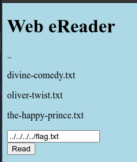

# Forbidden Paths

## Objetivo

Can you get the flag?Here's the [website](http://saturn.picoctf.net:49700/).We know that the website files live in `/usr/share/nginx/html/` and the flag is at `/flag.txt` but the website is filtering absolute file paths. Can you get past the filter to read the flag?

## Solución

Se visita la pagina web con el link adjunto.

Se introduce lo siguiente en la barra de busqueda

Y se obtiene la siguiente bandera:

Bandera: *picoCTF{7h3_p47h_70_5ucc355_6db46514}*

## Referencias
