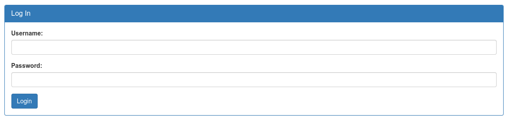
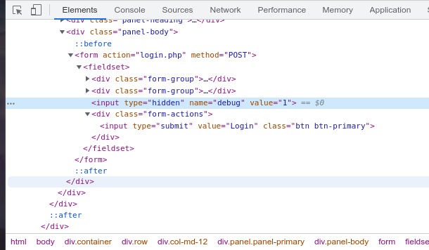
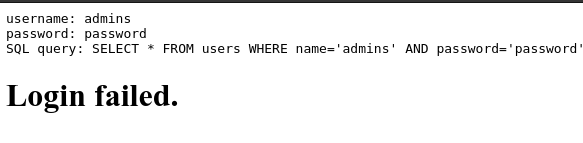
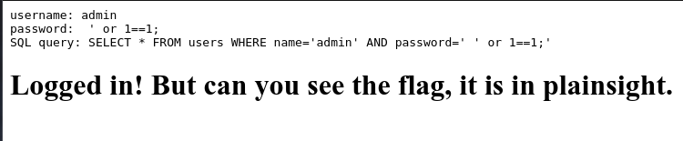
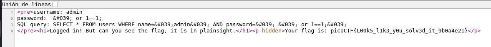

# SQLiLite

## Objetivo

Can you login to this website?Try to login [here](http://saturn.picoctf.net:59558/).

## Solución

Se visita la pagina con el enlace adjunto para poder ver lo siguiente:



Se inspecciona el codigo fuente y se cambia el campo oculto del formulario "debug" de *0* a *1*. 

```html
<input type="hidden" name="debug" value="1">
```



Al ingresar con un usuario y contraseña cualquiera, se puede ver la sentencia con la que se verifica que exista el usuario y contraseña.


Basado en la sentencia, se hace una inyeccion de codigo sql en la contraseña:

```sql
 ' or 1==1;
```

para poder observar lo siguiente:


Al observar el codigo fuente se puede ver la bandera.


Bandera: *Your flag is: picoCTF{L00k5_l1k3_y0u_solv3d_it_9b0a4e21}*

## Referencias
