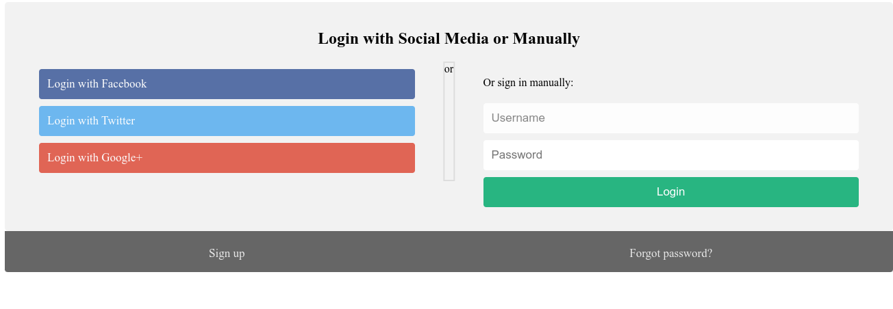

# Secrets

## Objetivo

We have several pages hidden. Can you find the one with the flag?The website is running [here](http://saturn.picoctf.net:61481/).

## Solución

Se visita la pagina con el enlace adjunto para poder visualizar lo siguiente:

Se accede al codigo fuente.

Se observa que existe un folder llamado **secret** por lo que se agrega a la URL de la siguiente manera.

*http://saturn.picoctf.net:61481/secret/index.html*

Para poder acceder, despues se observa lo siguiente:

Se observa que existe un folder llamado **hidden**. 

Por lo que se agrega a la URL de la siguiente manera:

*http://saturn.picoctf.net:61481/secret/hidden/index.html*

Se observa la siguiente pagina.

Al acceder al al codigo fuente, se puede observar un folder llamado **superhidden**.

Se agrega a la URL el folder de la siguiente manera:
*http://saturn.picoctf.net:61481/secret/hidden/superhidden/index.html*

Finalmente, se observa una pagina donde se encuentra la bander, esta oculta, por lo que es necesario selecionarla para poder distingirla

Bandera: *picoCTF{succ3ss_@h3n1c@10n_39849bcf}*

## Referencias
