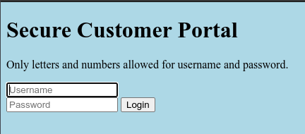
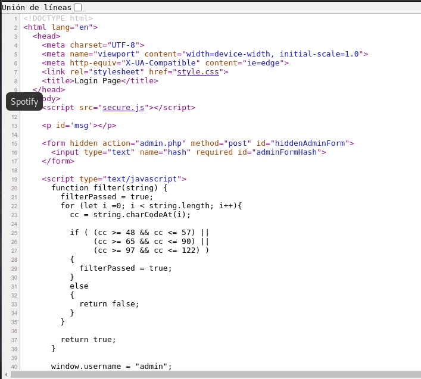
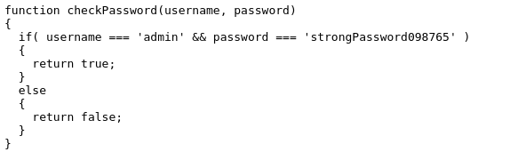
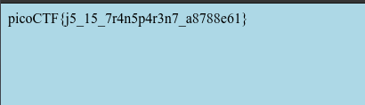

# Local Authority

## Objetivo

Can you get the flag?Go to this [website](http://saturn.picoctf.net:52682/) and see what you can discover.

## Solución

Se visita la pagina y se observa un formulario.

Al intentar loguearse con cualquier usuario y contraseña se obtine el siguiente error.

Al inspeccionar el codigo se puede ver lo siguiente varios archivos importados, se revisa *secure.js*.

El archivo *secure.js* contiene el siguiente codigo para verificar el usuario y contraseña del sistema.

Al ingresar al sistema con el usuario y contraseña obtenidos se obtiene la bandera.

Bandera: *picoCTF{j5_15_7r4n5p4r3n7_a8788e61}*

## Referencias
