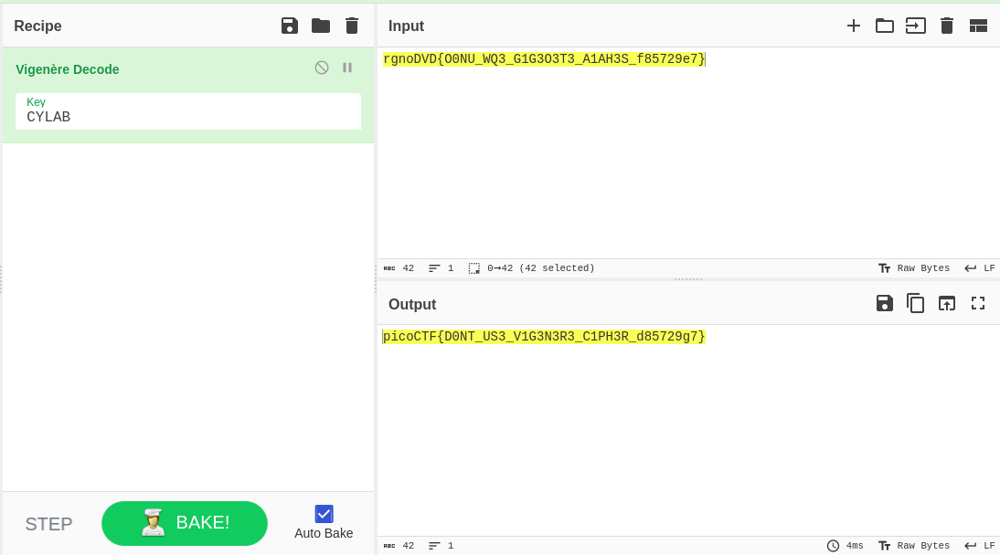

# Vigenere

## Objetivo

Can you decrypt this message?
Decrypt this message using this key "CYLAB".    

## Solución

```bash
hone@unidad03:~/vigenere$ cat cipher.txt 
rgnoDVD{O0NU_WQ3_G1G3O3T3_A1AH3S_f85729e7}
```

Se decodifica utilizando Vigenère cipher junto con la llave



Bandera: *picoCTF{D0NT_US3_V1G3N3R3_C1PH3R_d85729g7}*

## Referencias

[CyberChef](Lihttps://gchq.github.io/CyberChef/nk)
