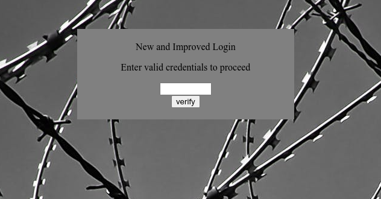

# Client-side-again

## Objetivo

Can you break into this super secure portal? `https://jupiter.challenges.picoctf.org/problem/60786/` ([link](https://jupiter.challenges.picoctf.org/problem/60786/)) or http://jupiter.challenges.picoctf.org:60786

## Solución

Se visita la pagina anexa y se observa lo siguiente



Al inspeccionar el codigo se puede observar una funcion en javaScripta que esta obfuscate.

```
var _0x5a46=['f49bf}','_again_e','this','Password\x20Verified','Incorrect\x20password','getElementById','value','substring','picoCTF{','not_this'];(function(_0x4bd822,_0x2bd6f7){var _0xb4bdb3=function(_0x1d68f6){while(--_0x1d68f6){_0x4bd822['push'](_0x4bd822['shift']());}};_0xb4bdb3(++_0x2bd6f7);}(_0x5a46,0x1b3));var _0x4b5b=function(_0x2d8f05,_0x4b81bb){_0x2d8f05=_0x2d8f05-0x0;var _0x4d74cb=_0x5a46[_0x2d8f05];return _0x4d74cb;};function verify(){checkpass=document[_0x4b5b('0x0')]('pass')[_0x4b5b('0x1')];split=0x4;if(checkpass[_0x4b5b('0x2')](0x0,split*0x2)==_0x4b5b('0x3')){if(checkpass[_0x4b5b('0x2')](0x7,0x9)=='{n'){if(checkpass[_0x4b5b('0x2')](split*0x2,split*0x2*0x2)==_0x4b5b('0x4')){if(checkpass[_0x4b5b('0x2')](0x3,0x6)=='oCT'){if(checkpass[_0x4b5b('0x2')](split*0x3*0x2,split*0x4*0x2)==_0x4b5b('0x5')){if(checkpass['substring'](0x6,0xb)=='F{not'){if(checkpass[_0x4b5b('0x2')](split*0x2*0x2,split*0x3*0x2)==_0x4b5b('0x6')){if(checkpass[_0x4b5b('0x2')](0xc,0x10)==_0x4b5b('0x7')){alert(_0x4b5b('0x8'));}}}}}}}}else{alert(_0x4b5b('0x9'));}}
```

Al desobfuscarla se obtiene el siguiente codigo.
```javaScript

var _0x5a46 = ["f49bf}", "_again_e", "this", "Password Verified", "Incorrect password", "getElementById", "value", "substring", "picoCTF{", "not_this"];  
(function(data, i) {  
 var validateGroupedContexts = function fn(selected_image) {  
   for (; --selected_image;) {  
     data["push"](data["shift"]());  
   }  
 };  
 validateGroupedContexts(++i);  
})(_0x5a46, 435);  
var _0x4b5b = function PocketDropEvent(ballNumber, opt_target) {  
 ballNumber = ballNumber - 0;  
 var ball = _0x5a46[ballNumber];  
 return ball;  
};  
function verify() {  
 checkpass = document[_0x4b5b("0x0")]("pass")[_0x4b5b("0x1")];  
 split = 4;  
 if (checkpass[_0x4b5b("0x2")](0, split * 2) == _0x4b5b("0x3")) {  
   if (checkpass[_0x4b5b("0x2")](7, 9) == "{n") {  
     if (checkpass[_0x4b5b("0x2")](split * 2, split * 2 * 2) == _0x4b5b("0x4")) {  
       if (checkpass[_0x4b5b("0x2")](3, 6) == "oCT") {  
         if (checkpass[_0x4b5b("0x2")](split * 3 * 2, split * 4 * 2) == _0x4b5b("0x5")) {  
           if (checkpass["substring"](6, 11) == "F{not") {  
             if (checkpass[_0x4b5b("0x2")](split * 2 * 2, split * 3 * 2) == _0x4b5b("0x6")) {  
               if (checkpass[_0x4b5b("0x2")](12, 16) == _0x4b5b("0x7")) {  
                 alert(_0x4b5b("0x8"));  
               }  
             }  
           }  
         }  
       }  
     }  
   }  
 } else {  
   alert(_0x4b5b("0x9"));  
 }  
}  
;
```

Se puede observar un arreglo con los siguientes elementos:
+ f49bf}
+ _again_e
+ this
+ Password Verified
+ Incorrect password
+ getElementById
+ value
+ substring
+ picoCTF{
+ not_this

De los cuales solamente algunos son utilizados para verificar en las validaciones que la contrasela es la correcta. Los cuales son los siguientes:
- f49bf}
- _again_e
- this
- picoCTF{
- not_this

Al acomodarlos se puede obtener la bandera.

Bandera: *picoCTF{not_this_again_ef49bf}*

## Referencias

https://en.wikipedia.org/wiki/Obfuscation
