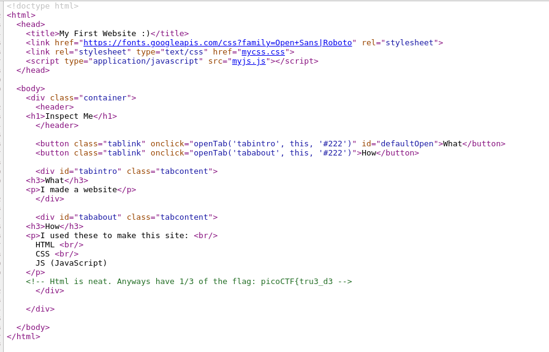
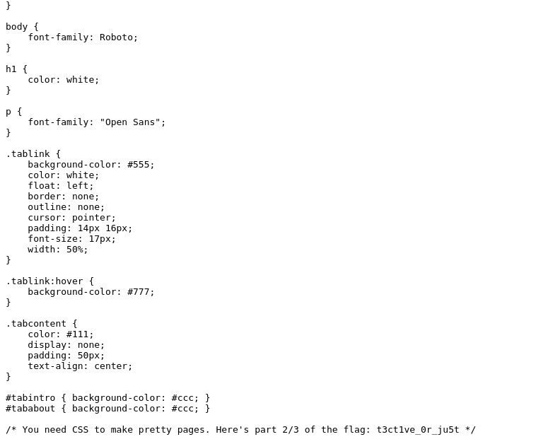
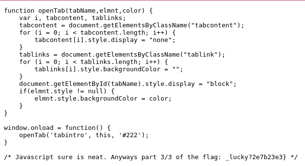

# Insp3ct0r

## Objetivo

Kishor Balan tipped us off that the following code may need inspection: `https://jupiter.challenges.picoctf.org/problem/9670/` ([link](https://jupiter.challenges.picoctf.org/problem/9670/)) or http://jupiter.challenges.picoctf.org:9670

## Solución

Se visita el link y se observa la pagina.

Se ve el codigo fuente de la pagina y se puede ver un comentario en el HTML, es la primera parte de la bandera.

Revisando el CSS se puede ver un comentario con la segunda parte de la bandera

Revisando el codigo JavaScript se observa la ultima parte de la bandera

Bandera: *picoCTF{tru3_d3t3ct1ve_0r_ju5t_lucky?2e7b23e3}*

## Referencias
