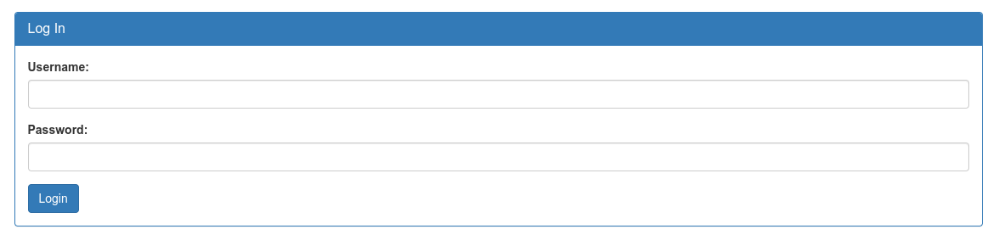
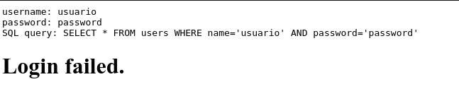

# Irish-Name-Repo-1

## Objetivo

There is a website running at `https://jupiter.challenges.picoctf.org/problem/39720/` ([link](https://jupiter.challenges.picoctf.org/problem/39720/)) or http://jupiter.challenges.picoctf.org:39720. Do you think you can log us in? Try to see if you can login!

## Solución

Se visita el enlace para poder visualizar la siguiente paguina:

En la pagina se puede visualizar un menu, en el que se observa un login para admin y se observa el siguiente formulario:

Al revisar el codigo fuente del formulario, cambiamos el valor oculto *debug* a **1**.

Y despues de colocar un Usuario y Password cualquiera se observa lo siguiente:

La sentencia SQL que se utiliza para verificar si el usuario y password es admin. Basado en eso, podemos deducir que se puede hacer una inyection de codigo SQL introduciendo en el password del formulario **' or 1 == 1;** y como usuario cualquier cosa . Al oprimir el boton para hacer el login se obtiene la bandera.

Bandera: *picoCTF{s0m3_SQL_c218b685}*

## Referencias
