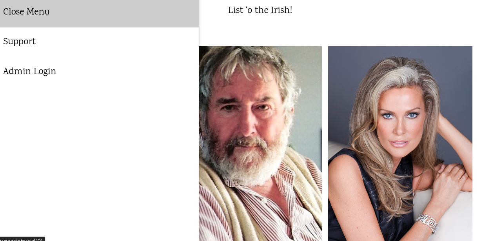
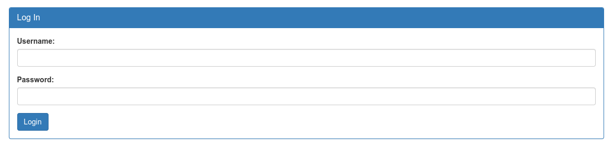
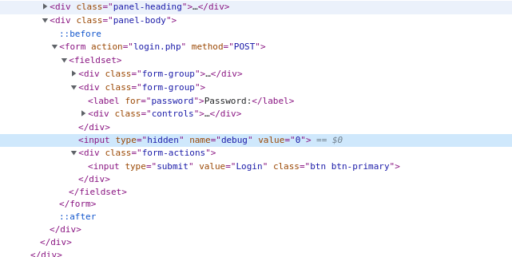
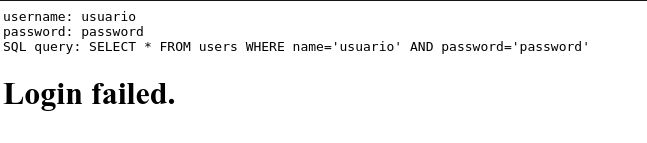
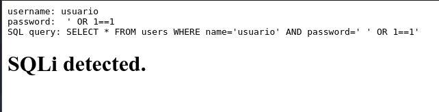
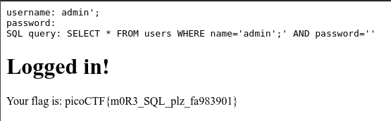

# Irish-Name-Repo_2

## Objetivo

There is a website running at `https://jupiter.challenges.picoctf.org/problem/52849/` ([link](https://jupiter.challenges.picoctf.org/problem/52849/)). Someone has bypassed the login before, and now it's being strengthened. Try to see if you can still login! or http://jupiter.challenges.picoctf.org:52849

## Solución

Se visita el enlace para poder visualizar la siguiente paguina:

En la pagina se puede visualizar un menu, en el que se observa un login para admin y se observa el siguiente formulario:

Al revisar el codigo fuente del formulario, cambiamos el valor oculto *debug* a **1**.

Y despues de colocar un Usuario y Password cualquiera se observa lo siguiente:

La sentencia SQL que se utiliza para verificar si el usuario y password es la misma que en el ejercicio  [Irish-Name-Repo_1](../Irish-Name-Repo_1/Irish-Name-Repo_1), sin embargo, esta vez no funcionara a causa de que ahora se esta protegido contra inyecciones SQL.

Pero aun es posible si en esta ocacion se escribe en *Username* del formulario **admin';** para obtener la bandera.

Bandera: *picoCTF{m0R3_SQL_plz_fa983901}*

## Referencias
