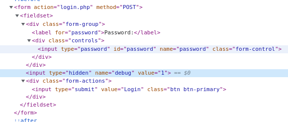
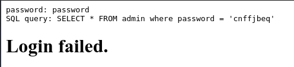
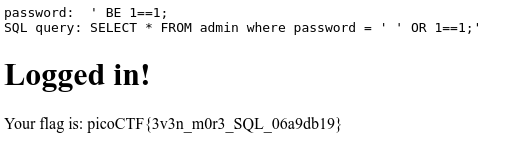

# Irish-Name-Repo 3

## Objetivo

There is a secure website running at `https://jupiter.challenges.picoctf.org/problem/29132/` ([link](https://jupiter.challenges.picoctf.org/problem/29132/)) or http://jupiter.challenges.picoctf.org:29132. Try to see if you can login as admin!

## Solución

Se visita el enlace para poder visualizar la siguiente paguina:

En la pagina se puede visualizar un menu, en el que se observa un login para admin y se observa el siguiente formulario:

Al revisar el codigo fuente del formulario, cambiamos el valor oculto *debug* a **1**.

Y despues de colocar como contraseña "password" se observa:

La contraseña esta encriptada, para hacer una inyeccion de codigo efectiva es necesario utilizar la tecnica "**rotate by 13 places** e introducir  **' BE 1 \=\=1;** para obtener la bandera.

Bandera: *picoCTF{3v3n_m0r3_SQL_06a9db19}*

## Referencias
