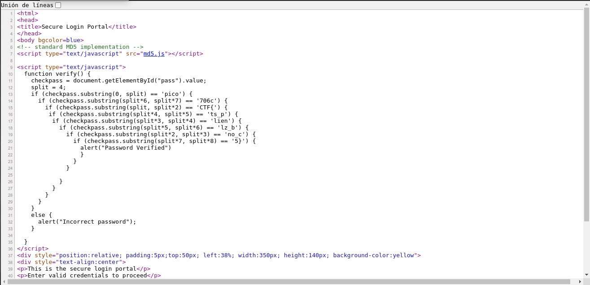

# dont-use-client-side

## Objetivo

Can you break into this super secure portal? `https://jupiter.challenges.picoctf.org/problem/17682/` ([link](https://jupiter.challenges.picoctf.org/problem/17682/)) or http://jupiter.challenges.picoctf.org:17682

## Solución

Se tiene que acceder a la pagina adjunta para poder visualizar lo siguiente:


Al insepeccionar el codigo fuente se puede ver una funcion que verifica que la contraseña sea la correcta. 



Funcion principal:

```javaScript
function verify() {

checkpass = document.getElementById("pass").value;

split = 4;

if (checkpass.substring(0, split) == 'pico') {
    if (checkpass.substring(split*6, split*7) == '706c') {
        if (checkpass.substring(split, split*2) == 'CTF{') {
            if (checkpass.substring(split*4, split*5) == 'ts_p') {
                if (checkpass.substring(split*3, split*4) == 'lien') {
                    if (checkpass.substring(split*5, split*6) == 'lz_b') {
                        if (checkpass.substring(split*2, split*3) == 'no_c') {
                            if (checkpass.substring(split*7, split*8) == '5}') {
                                alert("Password Verified")
                                }
                            }
                        }
                    }
                }
            }
        }
    }
    else {
    alert("Incorrect password");
    }
}
```

Por lo tanto, se pude obtener la contraseña deduciendo las validaciones en cada uno de los **if**, por lo que la contraseña es *picoCTF{no_clients_plz_b706c5}*, y asi se puede acceder aun cuando no es necesario, ya que la contraseña es la bandera

Bandera: *picoCTF{no_clients_plz_b706c5}}*

## Referencias
