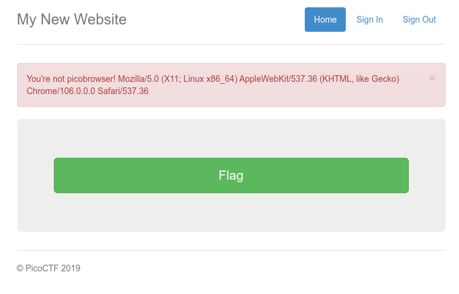

# picobrowser

## Objetivo

This website can be rendered only by **picobrowser**, go and catch the flag! `https://jupiter.challenges.picoctf.org/problem/28921/` ([link](https://jupiter.challenges.picoctf.org/problem/28921/)) or http://jupiter.challenges.picoctf.org:28921

## Solución

Se visita la pagina y se observa lo siguiente:


La presionar el boton, la pagina nos impide ver la bandera, ya que para poder obtenerla es necesario utilizar el navegador *picobrowser*, el cual no existe.



Para engañarlo es necesario modificar el **User Agent** y hacerle creer que accedemos al navegador utilizando la URL que se obtuvo al precionar el boton *Flag* de la siguiente forma.

```bash
hone@Unidad03:~$ curl -s "https://jupiter.challenges.picoctf.org/problem/28921/flag" -H "User-Agent: picobrowser" | grep picoCTF
<p style="text-align:center; font-size:30px;"><b>Flag</b>: <code>picoCTF{p1c0_s3cr3t_ag3nt_84f9c865}</code></p>
```

Bandera: *picoCTF{p1c0_s3cr3t_ag3nt_84f9c865}*

## Referencias
