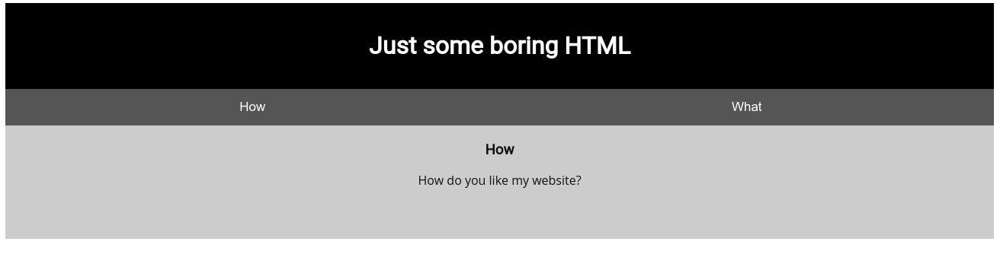
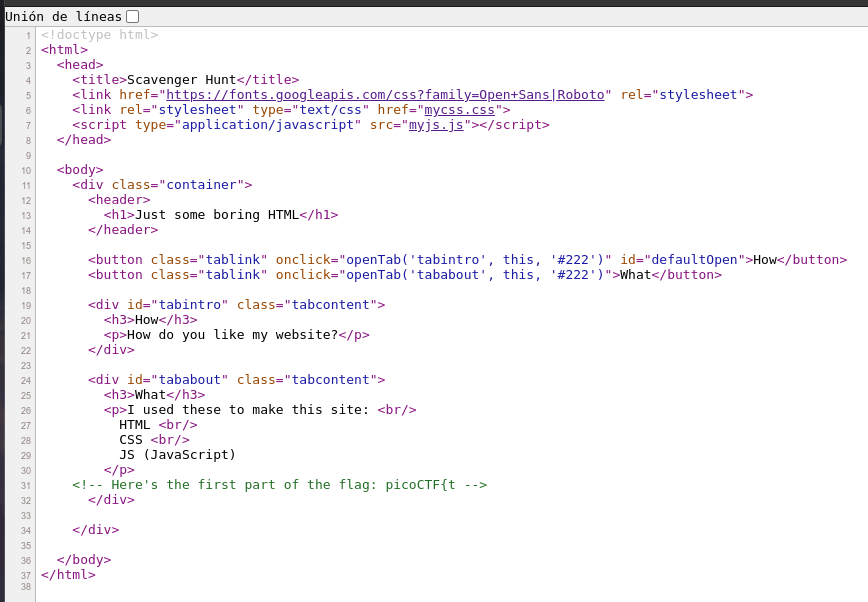
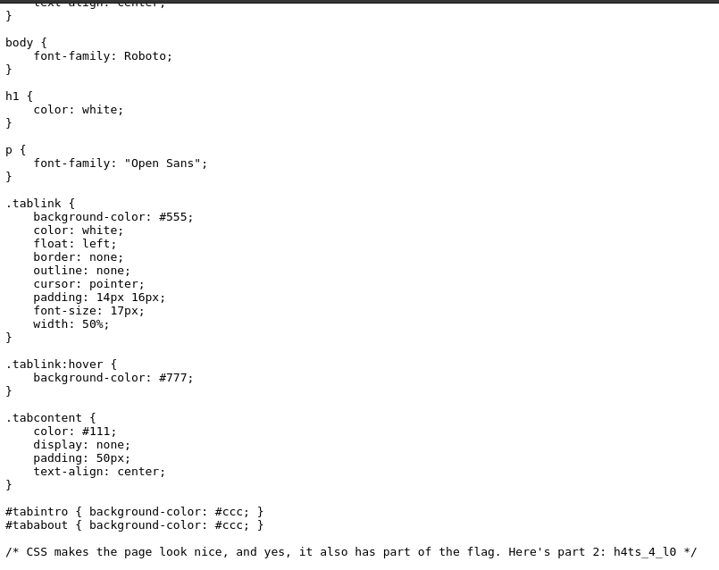

# Scavenger Hunt

## Objetivo

There is some interesting information hidden around this site [http://mercury.picoctf.net:39698/](http://mercury.picoctf.net:39698/). Can you find it?

## Solución

Se visita la pagina web anexa y se ve lo siguiente:

Al inspeccionar el codigo fuente de la pagina se la primera parte de la bandera

Se inspecciona el css de la pagina y se ve la parte dos de la bandera.

Inspeccionando el *robots.txt* se puede ver una pista y otra parte de la bandera.

Despues de inspeccionar el *.htaccess* en la pagina se observa otra pista y otra parte de la bandera

Revisando el .DS_Store de la pagina se observa la ultima pagina de la bandera.

Bandera: *picoCTF{th4ts_4_l0t_0f_pl4c3s_2_lO0k_fa04427c}*

## Referencias
