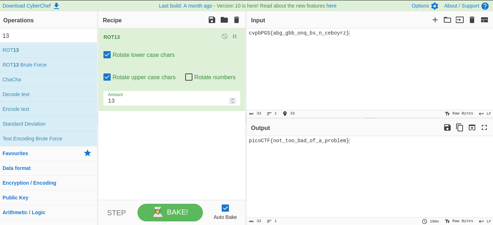

# 13

## Objetivo

Cryptography can be easy, do you know what ROT13 is? *cvpbPGS{abg_gbb_onq_bs_n_ceboyrz}*

## Solución

Se desencripta la bandera rotando 13 veces con CyberChef

Bandera: *picoCTF{not_too_bad_of_a_problem}*

## Referencias

[CyberChef](https://gchq.github.io/CyberChef/)