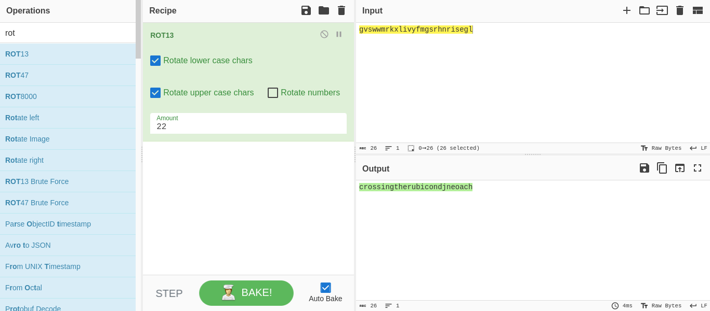

# Caesar

## Objetivo

Decrypt this [message](https://jupiter.challenges.picoctf.org/static/7d707a443e95054dc4cf30b1d9522ef0/ciphertext).

## Solución

Se dascarga el archivo con con el enlace adjunto, despues...

```bash
hone@unidad03:~/caesar$ cat ciphertext 
picoCTF{gvswwmrkxlivyfmgsrhnrisegl}
```

Se rota el mensaje 22 veces para obtener la bandera.



Bandera: *picoCTF{crossingtherubicondjneoach}*

## Referencias
