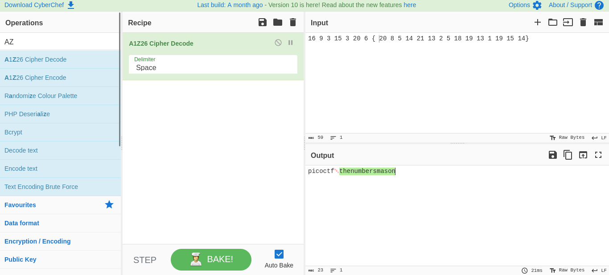

# The numbers

## Objetivo

The [numbers](https://jupiter.challenges.picoctf.org/static/f209a32253affb6f547a585649ba4fda/the_numbers.png)... what do they mean?

## Solución

Se descarga la siguiente imagen...

Escribir los numeros en cipherchef y desencriptarlos con A1Z26 muestra la llave.

Bandera: *picoCTF{thenumbersmason}*

## Referencias

[cipherchef](https://gchq.github.io/CyberChef/)
