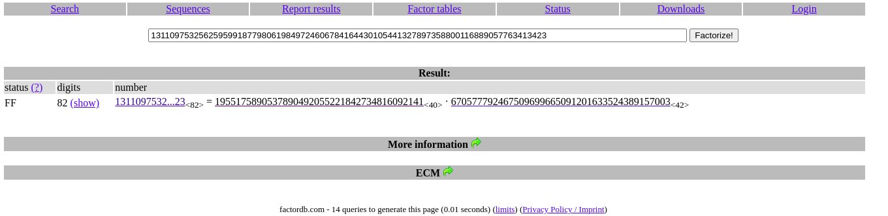

# Mind your Ps and Qs

## Objetivo

In RSA, a small e value can be problematic, but what about N? Can you decrypt this? [values](https://mercury.picoctf.net/static/2604f8b51a5cc62d38a3736938f19cef/values)

## Solución

```bash
hone@unidad03:~/mind_your_ps_and_qs$ cat values 
Decrypt my super sick RSA:
c: 861270243527190895777142537838333832920579264010533029282104230006461420086153423
n: 1311097532562595991877980619849724606784164430105441327897358800116889057763413423
e: 65537
```

Para obtener p y q, utilizamos un pagina para factorizar basado en n:



p = 1955175890537890492055221842734816092141

q = 670577792467509699665091201633524389157003

```python 3
hone@unidad03:~/Documentos/Materias/Seguridad_Redes_Sistemas/problemas-hacking/picoCTF/crypto/2021/mind_your_ps_and_qs$ python3
Python 3.9.2 (default, Feb 28 2021, 17:03:44) 
[GCC 10.2.1 20210110] on linux
Type "help", "copyright", "credits" or "license" for more information.
>>> from Crypto.Util.number import long_to_bytes
>>> from Crypto.Util.number import inverse
>>> c = 861270243527190895777142537838333832920579264010533029282104230006461420086153423
>>> n = 1311097532562595991877980619849724606784164430105441327897358800116889057763413423
>>> e = 65537
>>> p = 1955175890537890492055221842734816092141
>>> q = 670577792467509699665091201633524389157003
>>> tn = (p-1) * (q-1)
>>> d = inverse(e,tn
... )
>>> m = pow(c,d,n)
>>> long_to_bytes(m)
b'picoCTF{sma11_N_n0_g0od_13686679}'
>>> exit()
```

Bandera: *picoCTF{sma11_N_n0_g0od_13686679}*

## Referencias

[factordb](http://factordb.com/)
