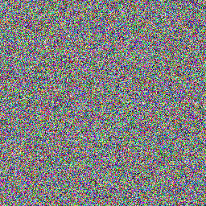
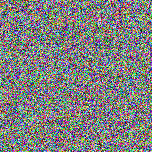
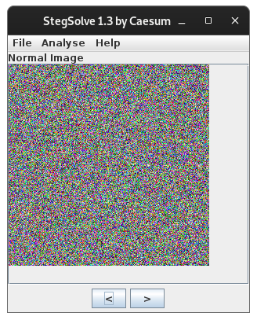
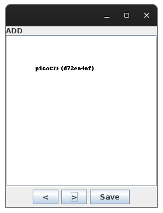

# Pixelated

## Objetivo

I have these 2 images, can you make a flag out of them? [scrambled1.png](https://mercury.picoctf.net/static/e8054e22552c6aba591cdf7440eb25e4/scrambled1.png) [scrambled2.png](https://mercury.picoctf.net/static/e8054e22552c6aba591cdf7440eb25e4/scrambled2.png)

## Solución

Descargamos dos imagenes con los enlaces adjuntos, muy parecidas pero que son distintas.






```bash
hone@unidad03:/opt/Stegsolve/bin$ java -jar stegsolve.jar
```

Se carga la primera imagen en el programa.


En la pestaña del programa, se selecciona **Analyse** -> **Image combiner** para cargar la segunda imagen, convinarlas y obtener el siguiente resultado.



Bandera: *picoCTF{d72ea4af}*

## Referencias

[Stegsolve](https://github.com/zardus/ctf-tools/blob/master/stegsolve/install)
