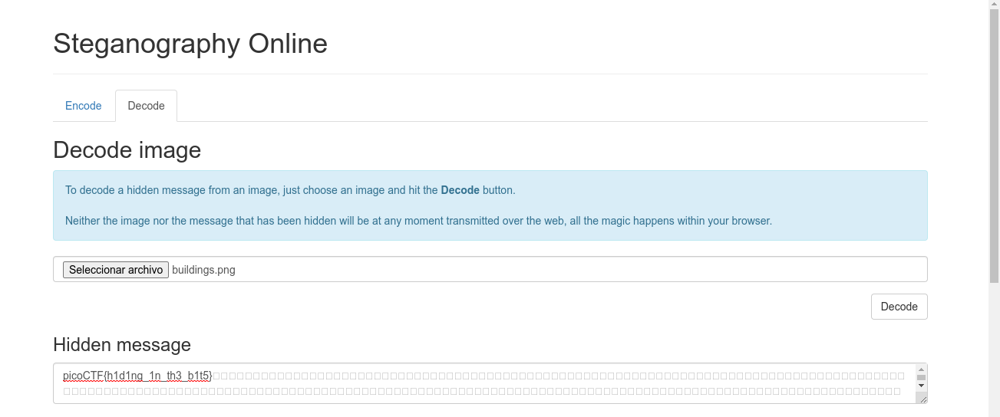

# What Lies Within

## Objetivo

There's something in the [building](https://jupiter.challenges.picoctf.org/static/011955b303f293d60c8116e6a4c5c84f/buildings.png). Can you retrieve the flag?

## Solución

Se descarga la siguiente imagen adjuna en el enlace.

Se abre un Steganography Online, y se sube la imagen descargada. Al oprimir el boton *Decode* se obtiene la bandera.

Bandera: *picoCTF{h1d1ng_1n_th3_b1t5}*

## Referencias

<https://stylesuxx.github.io/steganography/>
