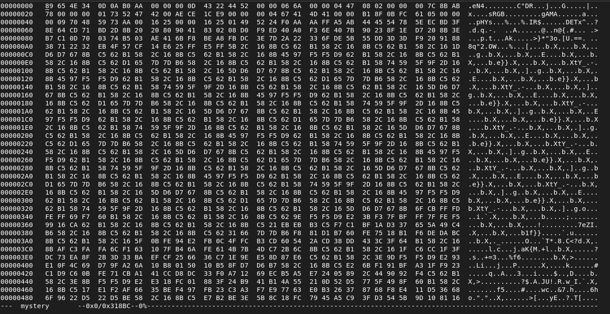
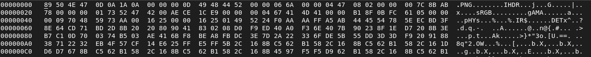
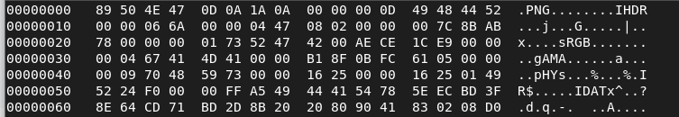
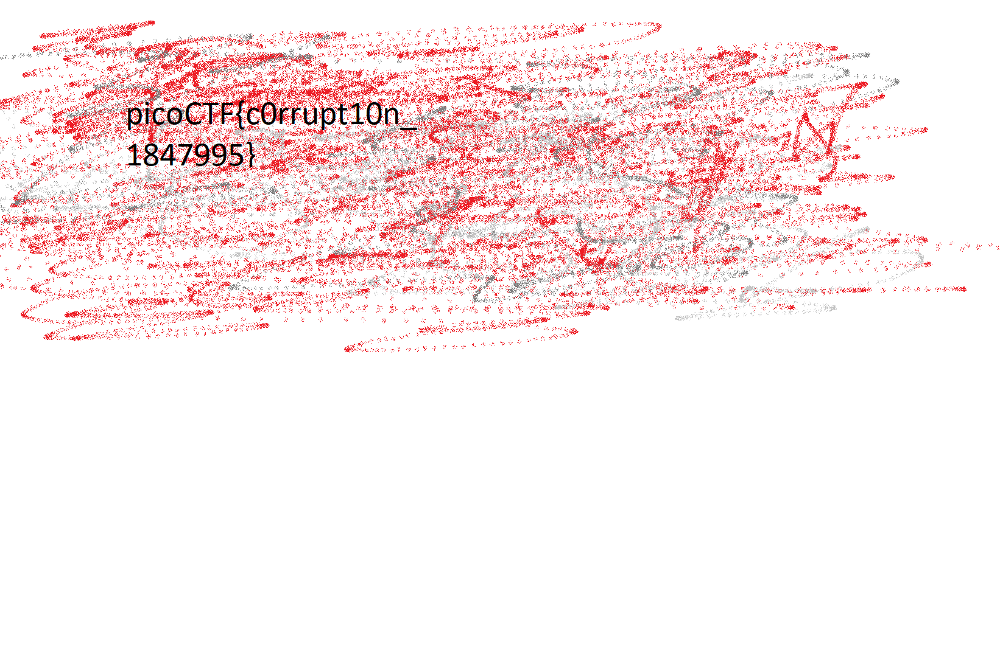

# c0rrupt

## Objetivo

We found this [file](https://jupiter.challenges.picoctf.org/static/ab30fcb7d47364b4190a7d3d40edb551/mystery). Recover the flag.

## Solución

Se revisa el tipo de archivo que se descargado

```bash
hone@unidad03:~/c0rrupt$ file mystery
mystery: data
```

```bash
hone@unidad03:~/c0rrupt$ hexedit mystery 
```

Al abrir el archivo con un editor hexadecimal se muestra lo siguiente



Se corrige el encabezado de la imagen de la siguiente manera



```bash
hone@unidad03:~/c0rrupt$ file mystery 
mystery: PNG image data, 1642 x 1095, 8-bit/color RGB, non-interlaced
```

Ahora es identificado como una imagen, pero aun no es posible abrirla, por lo que se vuelve a cambiar con el editor hexadecimal quedando de la siguiente manera



```bash
hone@unidad03:~/c0rrupt$ open mystery
```



Bandera: *picoCTF{C0rrupt10n_1847995}*

## Referencias
