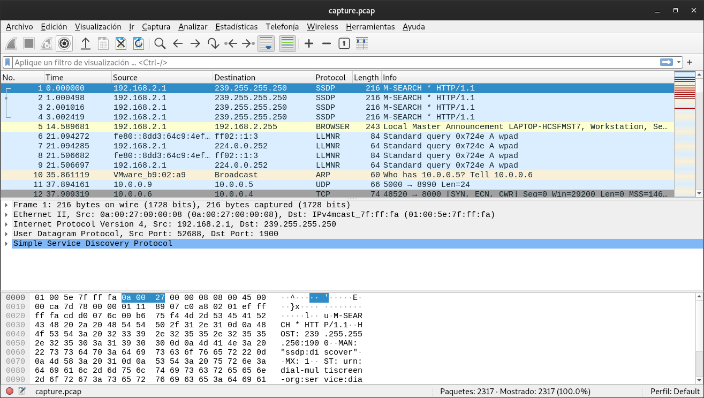
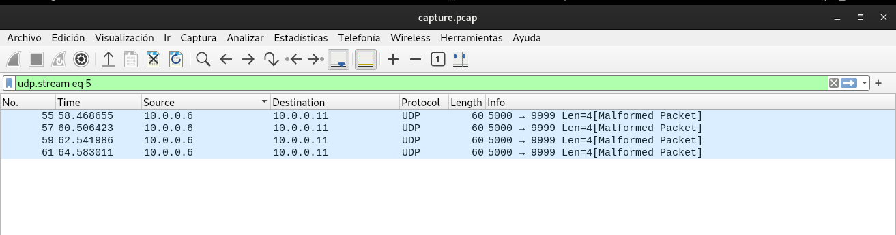
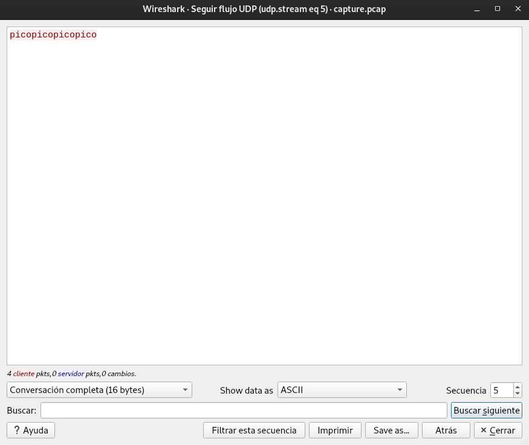
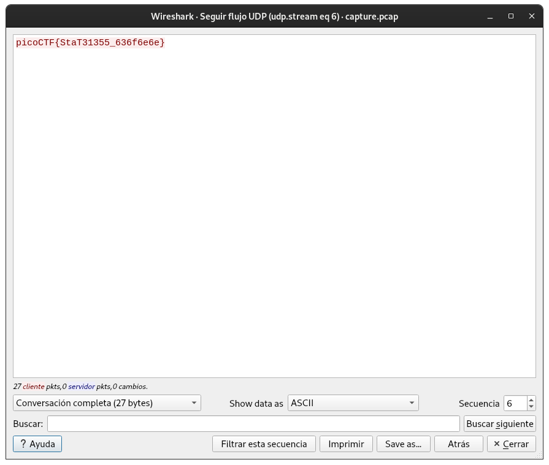

# shark on wire 1

## Objetivo

We found this [packet capture](https://jupiter.challenges.picoctf.org/static/483e50268fe7e015c49caf51a69063d0/capture.pcap). Recover the flag.

## Solución

Se abre el paquete descargado del enlace adjunto.

Se puede visualizar lo siguiente:

Se aplica el filtro de visualizacion **udp contains pico** para poder filtrar los paquetes y solo quedarse con:

Se hace click derecho sobre alguno de los paquetes filtrados y se aplica la opcion Seguir -> Flujo UDP.

Se aumenta la secuencia de 5 a 6 para poder obtener la bandera.

Bandera: *picoCTF{StaT31355_636f6e6e}*

## Referencias
