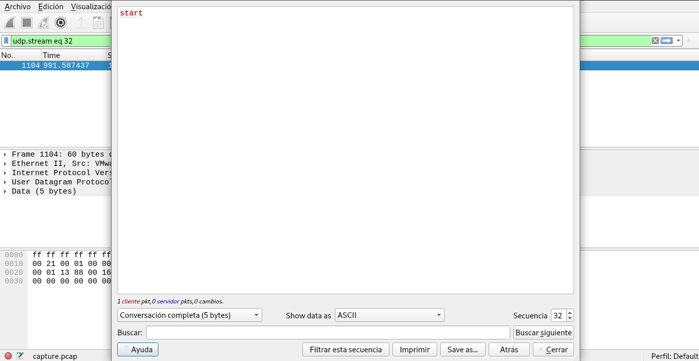
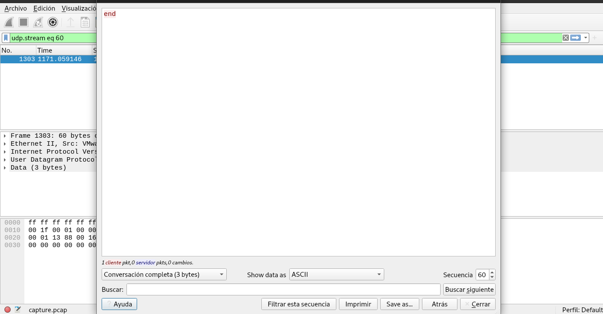
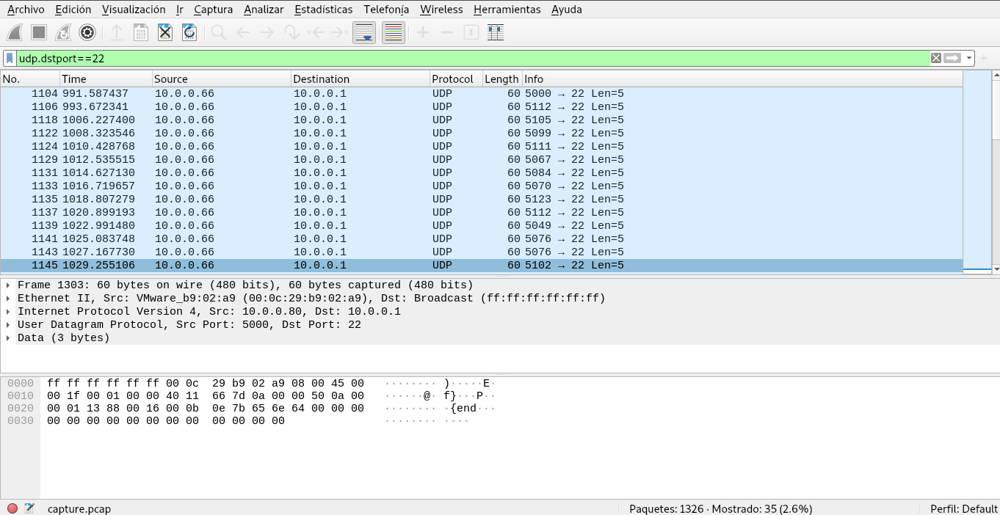

# Shark on wire 2

## Objetivo

We found this [packet capture](https://jupiter.challenges.picoctf.org/static/b506393b6f9d53b94011df000c534759/capture.pcap). Recover the flag that was pilfered from the network.

## Solución

Descargamos el archivo, y nos damos cuenta que es una captura de paquetes.

Al observar los paquetes, se observa que existen muchos paquetes UDP. Al situarnos en el numero 32 se observa el **start**



y en el 60 **end**.



Todos comparten como puerto destino 22, al filtrar todos estos paquetes se observa.



Todos los puertos destino origen son diferentes y cada uno representa un caracter ASCII si le restamos 5000.
Asi que se realiza el siguiente programa en python que toma esos puertos para obtener la llaves.

```python
from scapy.all import *

flag = ""

packets = rdpcap('capture.pcap')
for packet in packets:
    if UDP in packet and packet[UDP].dport == 22:
        flag += chr(packet[UDP].sport - 5000)
print(flag)
```

```bash
hone@unidad03:~/shark_on_wire_2$ python3 programa.py 
picoCTF{p1LLf3r3d_data_v1a_st3g0}
```

Bandera: *picoCTF{p1LLf3r3d_data_v1a_st3g0}*

## Referencias
