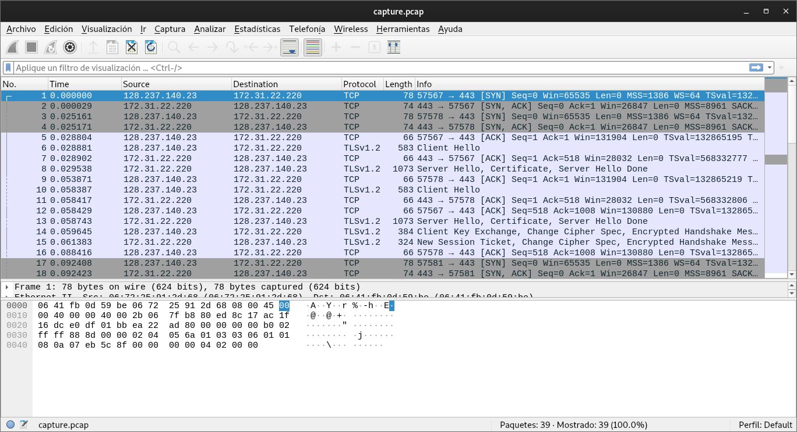
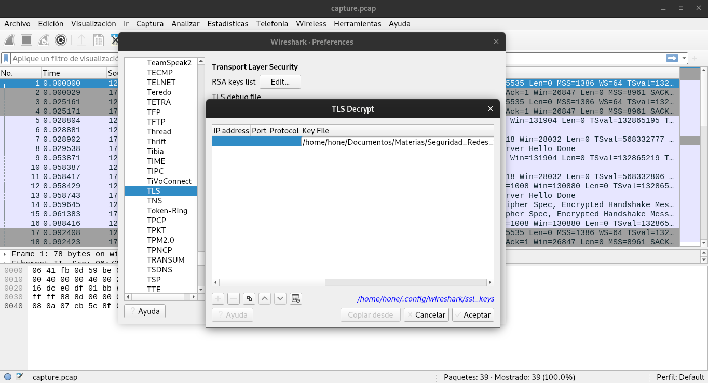
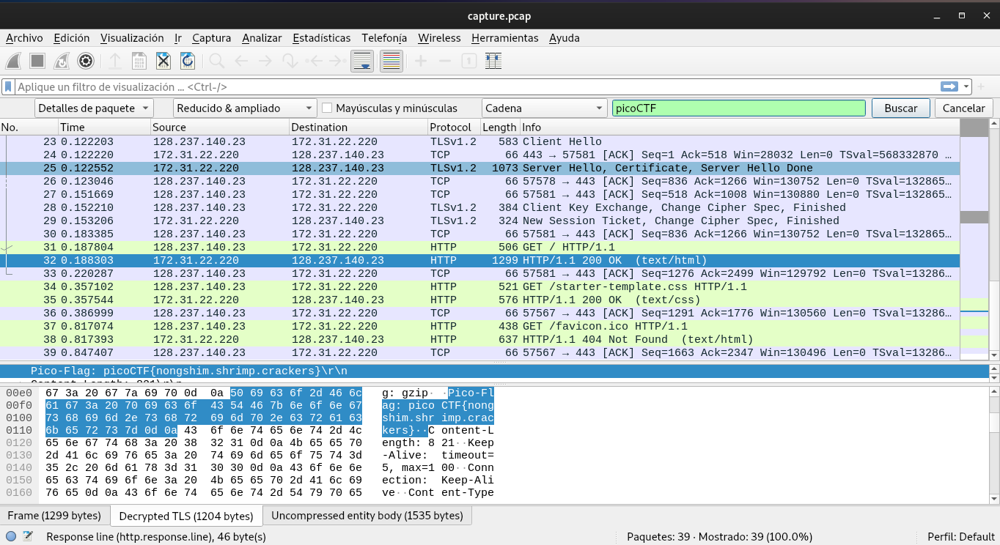

# WebNet0

## Objetivo

We found this [packet capture](https://jupiter.challenges.picoctf.org/static/0c84d3636dd088d9fe4efd5d0d869a06/capture.pcap) and [key](https://jupiter.challenges.picoctf.org/static/0c84d3636dd088d9fe4efd5d0d869a06/picopico.key). Recover the flag.

## Solución

Se descargan los paquetes rastreados y la llave. Al abrir los paquetes con el programa WireShark se observa lo siguiente.

Al utilizar la llave que se nos proporciona podemos desencriptar el protocolo TLS.

Despues de puede buscar la palabra "picoCTF" como una cadena en los detalles de los paquetes para encontrar la bandera.

Despues solo se tiene que copiar la bandera como texto imprimible para obtenerla.

Bandera: picoCTF{nongshim.shrimp.crackers}

## Referencias
