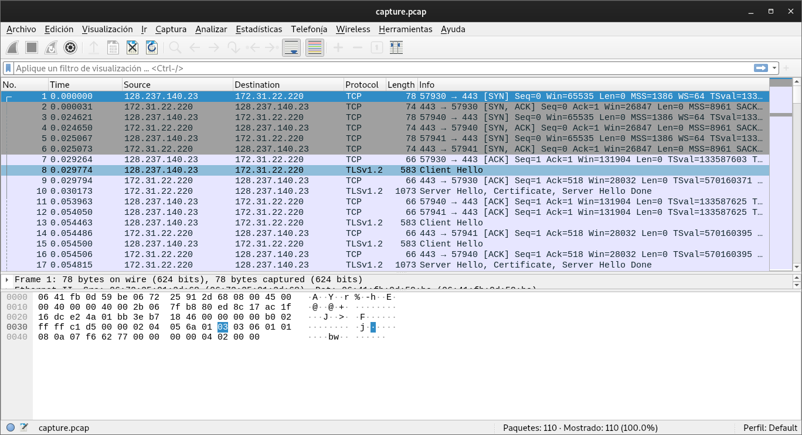
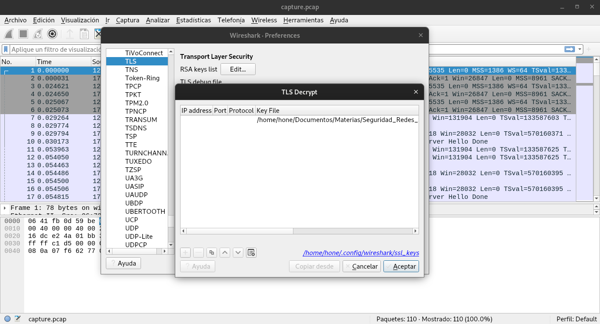
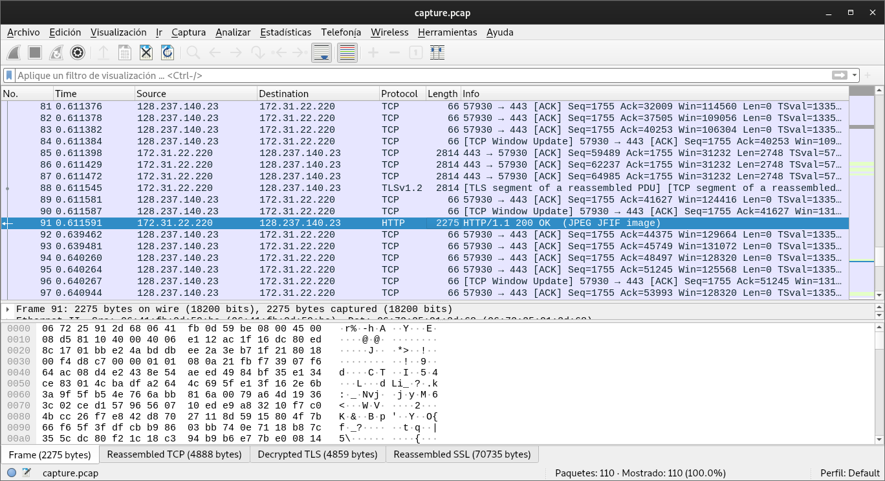
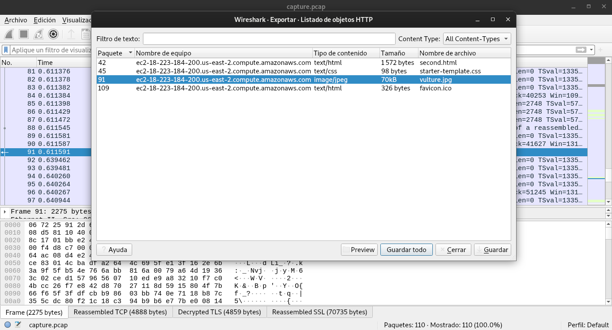

# WebNet0

## Objetivo

We found this [packet capture](https://jupiter.challenges.picoctf.org/static/fbf98e695555a2a48fe42c9a245de376/capture.pcap) and [key](https://jupiter.challenges.picoctf.org/static/fbf98e695555a2a48fe42c9a245de376/picopico.key). Recover the flag.

## Solucion


Se descargan los paquetes rastreados y la llave. Al abrir los paquetes con el programa WireShark se observa lo siguiente.



Al utilizar la llave que se nos proporciona podemos desencriptar el protocolo TLS.



Despues se observa en el paquete 91, que se descargó una imagen.



Despues se descargan los objetos



Y se realiza lo siguientes para obtener la bandera:

```bash
hone@unidad03:~/webnet1$ strings vulture.jpg | grep picoCTF
picoCTF{honey.roasted.peanuts}
```

Bandera: picoCTF{honey.roasted.peanuts}

## Referencias
