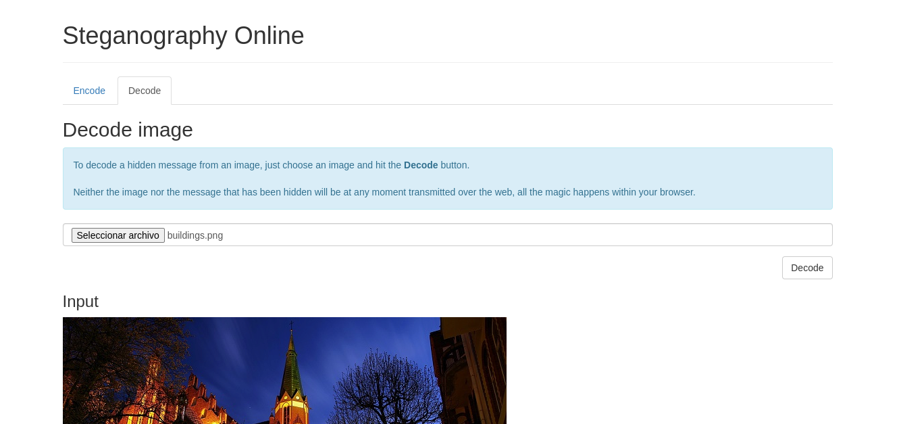
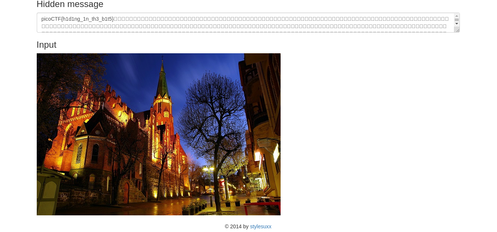

# What Lies Within

## Objetivo

There's something in the [building](https://jupiter.challenges.picoctf.org/static/011955b303f293d60c8116e6a4c5c84f/buildings.png). Can you retrieve the flag?

## Solución

Utilizando un decodificador y subir la imagen...

Despues de docodificar obtemos la bandera

Bandera: *picoCTF{h1d1ng_1n_th3_b1t5}*

## Referencias

https://stylesuxx.github.io/steganography/
