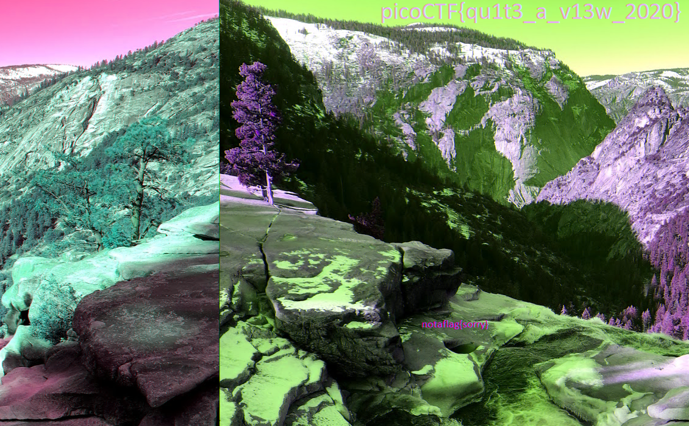

# tunn3l v1s10n

## Objetivo

We found this [file](https://mercury.picoctf.net/static/7b2d7c26630e977197022d0af09e3aeb/tunn3l_v1s10n  ). Recover the flag.

## Solución

Se descarga la imagen con el link adjunto, despues de abrirla se observa la siguiente imagen.

Es nesesario cambiar el alto de la imagen con un editor hexadecimal para que quede de la siguiente manera.

Se vuelve a abrir y se muestra la bandera

Bandera: *picoCTF{qu1t3_a_v13w_2020}*

## Referencias
